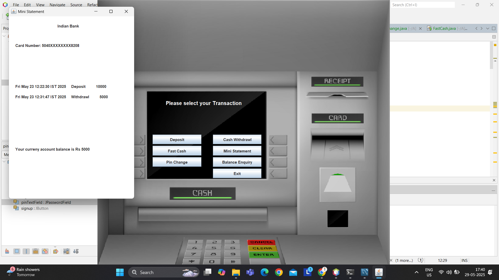

# 💳 ATM Simulator System

This is a Java-based **ATM Simulator System** developed using **Java Swing**, **AWT**, and **JDBC**. It provides a GUI-based simulation of an ATM machine, enabling basic banking operations such as deposit, withdrawal, balance enquiry, and more.

---

## 🚀 Features

- 🔐 **Login Authentication** using secure PIN
- 🔄 **PIN Change** functionality
- 💰 **Balance Enquiry** to view current account balance
- ➕ **Deposit** money into the account
- ➖ **Withdraw** funds with balance validation
- 🧾 **Mini Statement** to show recent transactions
- ⚡ **Fast Cash** – Quick withdrawal of predefined amounts (e.g., ₹500, ₹1000, ₹2000, etc.)

---

## 🛠️ Technologies Used

| Tech         | Description                          |
|--------------|--------------------------------------|
| Java         | Core programming language            |
| Java Swing   | GUI components                       |
| AWT          | Basic GUI event handling             |
| JDBC         | Database connectivity                |
| MySQL        | Backend database to store user data  |

---

## 🗃️ Database Structure

- `customers` – Stores customer details (account no., name, PIN, balance)
- `transactions` – Stores transaction history (deposit, withdrawal, etc.)

> NOTE: Make sure MySQL is properly configured and the database tables are created before running the application.

---

## 📸 Screenshots


<p float="left">
  
  
  
</p>

---

## ⚙️ How to Run

1. Clone the repository:

   ```bash
   git clone https://github.com/yourusername/atm-simulator-system.git

2. Import the project in any Java IDE (e.g., IntelliJ, Eclipse, NetBeans).

3. Set up the MySQL database:
       Create a database (e.g., atm_db)
       Run the SQL script in /database/schema.sql (if provided)

4. Configure the DB connection in the code (usually in a class like DBConnection.java).

5. Run the main application file (e.g., Main.java).

